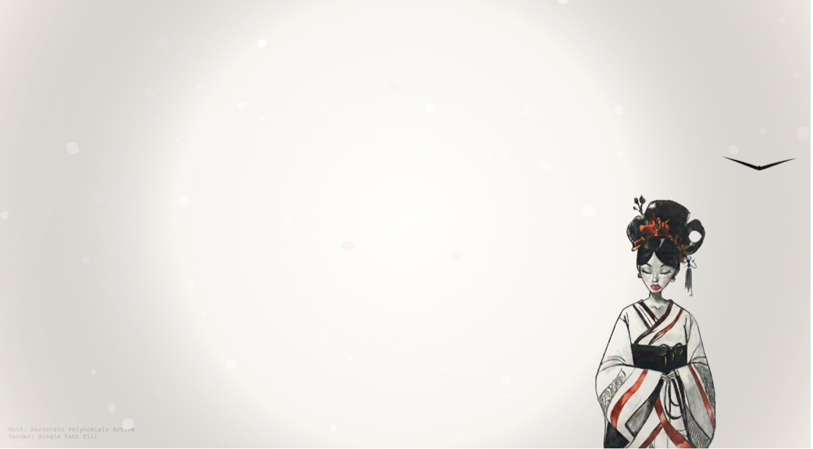

# 🎨 Generative Art with Bézier Curves: "Silent Glide"
### (Bézier Eğrileri ile Generatif Sanat: "Sessiz Süzülme")
EN: A hybrid digital art project that combines mathematical modeling with real-time asset manipulation to create a cinematic scene inspired by Japanese "Sumi-e" aesthetics.

TR: Matematiksel modellemeyi gerçek zamanlı varlık manipülasyonuyla birleştirerek Japon "Sumi-e" estetiğinden ilham alan sinematik bir sahne oluşturan hibrit bir dijital sanat projesi.

---

## 🇬🇧 English Description

### 🌟 Project Overview
"Silent Glide" is a front-end experiment that visualizes organic movement using procedural generation. Instead of using pre-made animations, the movement of the bird and the falling petals are calculated in real-time using mathematical formulas.

### 🛠️ Technical Implementation
* **Mathematical Modeling (Bézier Curves):** The bird's body and wings are rendered using cubic Bézier equations. Points are calculated programmatically to ensure smooth, organic motion.
* **Stochastic System (Particle Physics):** The Sakura petals use a probability-based system (stochastic modeling) for their position, rotation, and falling speed, ensuring a unique experience in every frame.
* **Pixel Manipulation:** The central figure (`kiz.png`) is processed dynamically. The script scans the **RGBA pixel data** of the image and removes white background values in real-time, allowing the figure to blend seamlessly into the generative scene.
* **Camera State Machine:** A custom logic system (Search, Zoom, Follow, Reset) manages the camera's focus on the generated entities, creating a cinematic feel.

---

## 🇹🇷 Türkçe Açıklama

### 🌟 Proje Özeti
"Silent Glide", organik hareketleri prosedürel üretimle görselleştiren bir web grafik çalışmasıdır. Hazır animasyonlar kullanmak yerine, kuşun hareketi ve yaprakların düşüşü tamamen matematiksel formüllerle anlık olarak hesaplanır.

### 🛠️ Teknik Uygulama
* **Matematiksel Modelleme (Bézier Eğrileri):** Kuşun gövdesi ve kanatları kübik Bézier denklemleriyle çizilmiştir. Akıcı ve organik bir hareket sağlamak için noktalar programatik olarak hesaplanır.
* **Stokastik Sistem (Partikül Fiziği):** Sakura yaprakları; konum, dönüş ve düşüş hızı için olasılık tabanlı bir sistem kullanarak her karede benzersiz bir görünüm sunar.
* **Piksel Manipülasyonu:** Ana figür olan `kiz.png`, kod tarafında dinamik olarak işlenir. Yazılım, görselin **RGBA piksel verilerini** tarar ve beyaz arka plan değerlerini anlık olarak temizleyerek figürün sahneyle bütünleşmesini sağlar.
* **Kamera Durum Makinesi:** Özel bir mantık sistemi (Arama, Odaklanma, Takip, Sıfırlama) kullanarak, kameranın otonom varlıklara odaklanmasını ve sinematik bir akış oluşmasını sağlar.

---

## 🚀 How to Run? / Nasıl Çalıştırılır?

**🇬🇧 English:**
1. Clone the repository:
   `git clone https://github.com/Sumeyye-ikiz/Generative-Art-Bezier-Curves.git`
2. Ensure the image file **`kiz.png`** is in the same folder as **`index.html`**.
3. Open **`index.html`** in any modern web browser.

**🇹🇷 Türkçe:**
1. Depoyu klonlayın:
   `git clone https://github.com/Sumeyye-ikiz/Generative-Art-Bezier-Curves.git`
2. **`kiz.png`** görsel dosyasının **`index.html`** ile aynı klasörde olduğundan emin olun.
3. **`index.html`** dosyasını herhangi bir modern web tarayıcısında açın.
